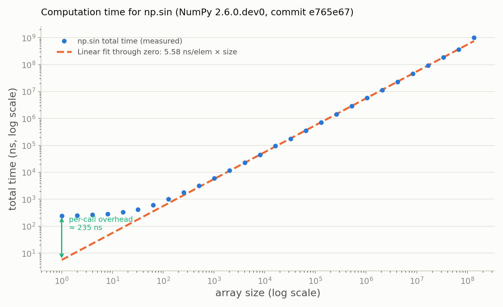
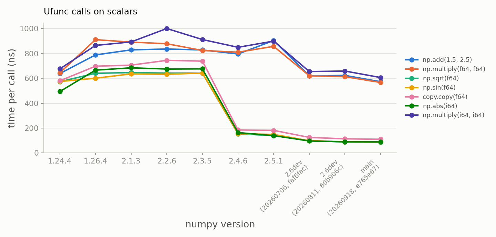
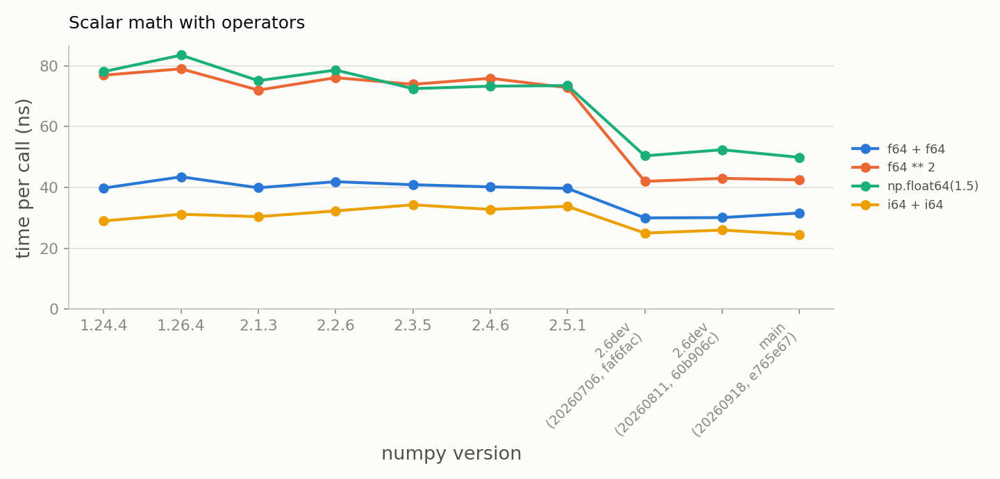
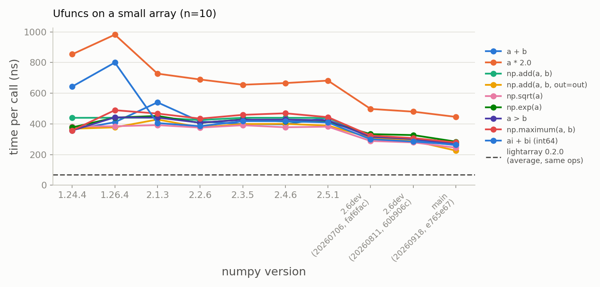
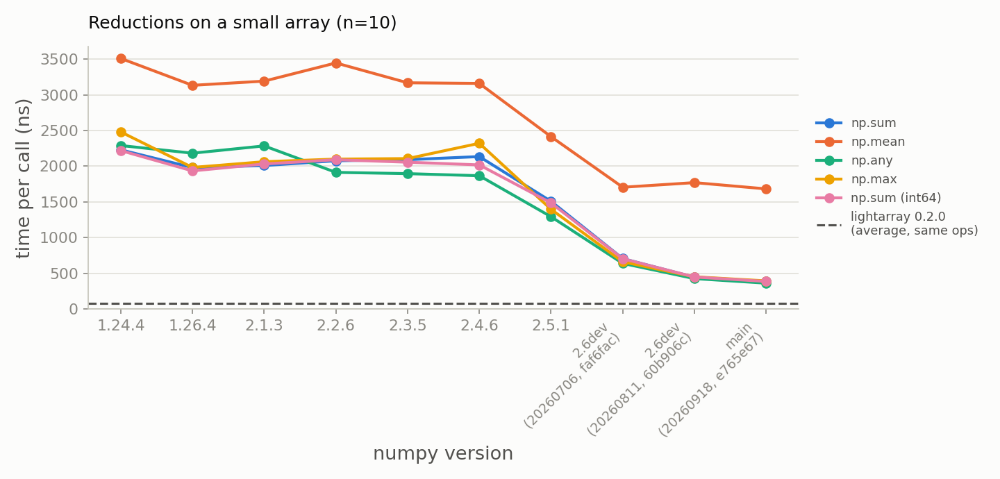
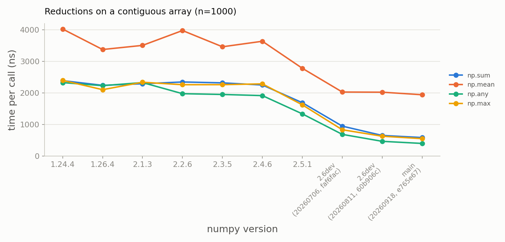
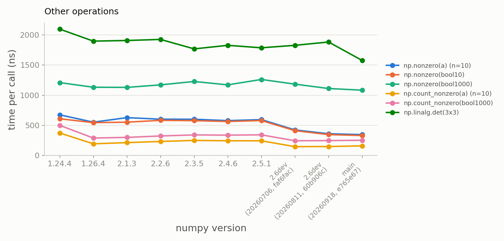
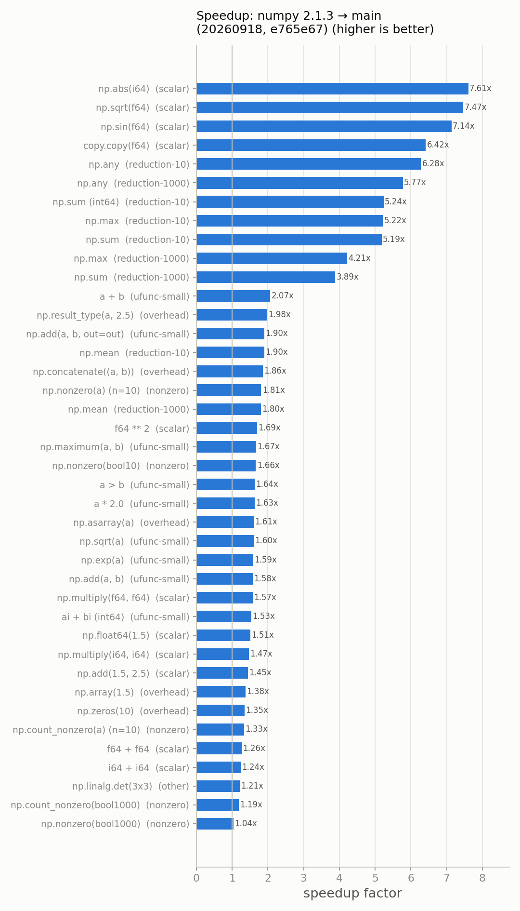

# NumPy performance on scalars and small arrays

NumPy is famous for crunching large arrays at near-C speed, but a lot of
real-world code calls NumPy on *scalars* and *small arrays*: a physics
simulation updating a 3-vector, an optimizer evaluating a cost on a handful of
parameters, or a Pandas column of tiny groups. For such inputs the actual
arithmetic is negligible — the runtime is dominated by *per-call overhead*.

Over the last few years a long series of pull requests has chipped away at this
overhead. This post measures the cumulative effect by benchmarking the same
micro-operations across NumPy releases; the [PR list](#appendix-performance-prs-for-scalars-and-small-arrays)
and the [benchmark details](#appendix-reproducing-the-benchmarks) are at the
bottom.

## Where the time goes

A call like `np.add(a, b)` on two 10-element arrays spends almost none of its
time adding numbers. The bulk goes to argument parsing, override dispatch
(`__array_ufunc__`), dtype resolution and promotion, ufunc loop selection,
iterator setup, and wrapping the result. These are fixed costs, independent of
array size — for scalars and small arrays they *are* the runtime.

<!-- Source: bench_sin_sizes.py, plot_sin_overhead.py -->


The chart above plots the total time of `np.sin()` on float64 arrays ranging
from 1 to 134 million elements, on log-log axes. The dashed line is a
proportional fit in normal space, `time = cost × size`, through the origin,
to all points of 10⁵ elements or more (weighted by relative error so that every
decade of sizes counts equally). A line through the origin is a straight line
of slope 1 on log-log axes, and the large arrays follow it over three decades:
the per-element cost of `sin()` is ~5.6 ns. Below ~100 elements the measured
points peel away from the line and flatten at ~240 ns: the fixed per-call
overhead, which is the vertical gap between the first point and the line.
The two regimes meet around 40 elements, where overhead and computation cost
the same.

Getting the large-array points onto a straight line required removing three
sources of skew from the benchmark, all worth knowing about when timing ufuncs:

* **Argument magnitude.** With `np.arange(size)` as input, the largest arrays
  contain values above ~1e8, where the libm `sin()` range reduction is ~5×
  slower. The benchmark now uses `np.linspace(0, 2π, size)`.
* **Branch prediction.** The same values in random order run ~2.4× slower per
  element than sorted, because the double-precision `sin` on this (AVX2)
  machine is glibc's scalar `sin`, which branches on the argument range. The
  penalty only shows for arrays above ~4096 elements: for smaller arrays the
  timing loop repeats the same data and the branch predictor memorizes the
  pattern, which is a benchmark artifact rather than a property of `np.sin`.
* **Memory allocation.** Every call allocates a fresh output. With default
  glibc settings that memory is returned to the OS after each call and
  page-faulted in again on the next, at a cost that depends on the size and on
  transparent-hugepage state (up to +5 ns/elem for 4–16 MB arrays). The
  benchmark configures malloc to keep the heap, disables NumPy's hugepage
  advice, and re-creates the input array for each timing round. One residue
  remains: the 1 GiB (134M-element) arrays run ~35% slower per element in a
  way that depends on where the buffers land in memory, with no page faults
  involved; that point sits visibly above the line.

For numpy main as of September 2026 (the build used for the chart above),
per-call setup overhead is roughly 240 ns for a single-element call, an order
of magnitude above what pure arithmetic would cost.

See [Teaching NumPy's ufuncs new tricks](https://labs.quansight.org/blog/teaching-numpys-ufuncs-new-tricks)
(Iason Krommydas, 2026) for a detailed walkthrough of ufunc machinery internals,
including how the loop dispatch, stride handling, and reduction operations work
at the C level.

## Results

For benchmark details see [benchmark setup](#benchmark-setup). The operands in the chart legends are:

| Name | Operand |
|---|---|
| `f64`, `i64` | NumPy scalars: `np.float64(1.5)` and `np.int64(3)` |
| `1.5`, `2.5` | plain Python floats |
| `a`, `b` | float64 arrays of shape `(10,)` |
| `ai`, `bi` | int64 arrays of shape `(10,)` |
| `bool10`, `bool1000` | boolean arrays of shape `(10,)` and `(1000,)` |
| n=1000 reductions | a float64 array of shape `(1000,)` |
| `3x3` | a float64 matrix of shape `(3, 3)` |

### Ufuncs on scalars

<!-- Source: bench_cases.py, plot_results.py (scalar_ufunc group) -->


<!-- Source: bench_cases.py, plot_results.py (scalar group, operator subset) -->


**NumPy 2.4 made unary ufunc calls on NumPy scalars ~4.5× faster**
([#29819](https://github.com/numpy/numpy/pull/29819)), independent of dtype;
scalar `copy.copy` shows the same jump
([#29656](https://github.com/numpy/numpy/pull/29656)). Binary calls like
`np.multiply(f64, f64)` don't benefit: the fast path only covers
single-argument calls, so each operand still pays a full scalar→0-d-array
conversion — extending it to binary calls is ongoing work
([gh-24345](https://github.com/numpy/numpy/issues/24345),
[#29876](https://github.com/numpy/numpy/pull/29876)). Operator-based scalar
math was always fast: on scalars, `f * g` (~40 ns) beats `np.multiply(f, g)`
(~900 ns) by an order of magnitude in every version.

### Ufuncs on small arrays

<!-- Source: bench_cases.py, plot_results.py (ufunc-small group) -->


Elementwise operations on a 10-element array are flat at ~350–440 ns per call
from 1.24 all the way through the 2.6 nightly: fixed per-call overhead, not
the 10 additions, sets the price. `a * 2.0` is the most expensive because the
Python scalar is converted and promoted on every call. One dtype note: int64
`a + b` was ~1.7× slower than float64 on 1.24/1.26 and has been on par since
2.1.

The dashed line is a reference from outside NumPy: the average time of
[lightarray](https://github.com/eendebakpt/lightarray) on the same
operations, with lightarray arrays as input (see
[below](#how-fast-could-it-be) for what that package is): ~70 ns. The `out=`
variant is left out of the average, because lightarray delegates it to NumPy.

### Reductions: mean, sum, any, all, min, max

<!-- Source: bench_cases.py, plot_results.py (reduction-10 group) -->


<!-- Source: bench_cases.py, plot_results.py (reduction-1000 group) -->


Reductions carry far more setup cost than elementwise ufuncs — through numpy
2.4, summing *ten* elements took ~2 µs — and the n=1000 numbers are barely
higher than n=10, so reductions are overhead-dominated even at a thousand
elements. Two releases cut into this: **numpy 2.5** sped up all reductions
1.3–1.7× with a fast path for full contiguous reductions
([#31274](https://github.com/numpy/numpy/pull/31274)), and the **2.6 nightly**
cuts `sum`/`any`/`all`/`min`/`max` by another ~2.3× to ~650 ns
([#31845](https://github.com/numpy/numpy/pull/31845),
[#32041](https://github.com/numpy/numpy/pull/32041)). `np.mean` benefits less
— its Python-level wrapper adds ~1.8 µs on top of the underlying reduction.
int64 matches float64 throughout.

As in the ufunc chart, the dashed line in the n=10 chart is the average time
of lightarray on the same five reductions with lightarray arrays as input:
~80 ns. Four of them take 40–70 ns; the int64 `sum` is the exception at
~190 ns, a path lightarray has not optimized yet.

### Other operations

<!-- Source: bench_cases.py, plot_results.py (nonzero and other groups) -->


For `np.nonzero` and `np.count_nonzero`, per-call overhead is flat across the
releases: ~600 ns for `np.nonzero` on 10 elements and ~1.2 µs at n=1000; `np.count_nonzero` is ~2.5× cheaper.
Improvements do exist, but not in this regime:
[#27523](https://github.com/numpy/numpy/pull/27523) (merged in 2.3) made
`np.count_nonzero` on float arrays ~3× faster in *throughput* (313 µs →
100 µs at n=100,000 in a spot check), which is invisible at the sizes plotted
here, and [#27519](https://github.com/numpy/numpy/pull/27519) (still open)
would speed up `np.nonzero` for contiguous 1-D/2-D arrays.

`np.linalg.det` on a 3×3 matrix is a typical small linear-algebra call: it
costs ~1.8–2.1 µs on every release and ~1.6 µs on the newest main build. The
LU factorization of nine numbers is a small part of that; most of the time
goes to the Python wrapper (array conversion, shape and type checks) and the
generalized-ufunc call underneath. This case was measured on the Linux machine
for all versions.

### Dispatched methods

<!-- Source: bench_dispatched.py, plot_results.py (shape, reduction_dispatch, selection, other groups) -->
NumPy has over 250 array methods that dispatch through `@array_function_dispatch`,
including shape operations (`np.ravel`, `np.transpose`, `np.reshape`), reductions
with state (`np.cumsum`, `np.cumprod`), and selection/indexing (`np.take`,
`np.argsort`, `np.searchsorted`). Historically, the dispatch overhead from the
Python-level `__array_function__` protocol added significant cost for small arrays.

PR [#32523](https://github.com/numpy/numpy/pull/32523) introduces a fast dispatcher
mechanism that skips `__array_function__` for pure ndarray operations, forwarding
relevant calls directly to C implementations. This yields **1.3–2.7× speedups**
across the board:

- **Shape manipulation**: `np.ravel` (2.7×), `np.transpose` (2.0×), `np.reshape` (1.3×)
- **Sequential operations**: `np.cumsum` (1.5×), `np.cumprod` (1.5×)
- **Selection/search**: `np.take` (1.4×), `np.searchsorted` (1.4×), `np.argsort` (1.3–1.4×)
- **Reduction-style dispatches**: `np.argmin`/`np.argmax` (1.8×), `np.nonzero` (1.5×)

The speedups are uniform across array sizes because dispatch overhead is size-independent;
they apply even for single-element or small arrays where element-wise work is negligible.
For example, `np.ravel` on a 3×3 array drops from 257 ns to 97 ns, and `np.cumsum` on
10 elements from 876 ns to 582 ns.

### Summary

<!-- Source: bench_cases.py, plot_results.py (speedup calculation comparing oldest and newest CPython-matched versions) -->


Same-interpreter speedup from numpy 2.1.3 to the 2.6 nightly: the scalar and
reduction paths improved 2–5×, the rest is unchanged.

## How fast could it be?

The measurements above show per-call overhead shrinking from release to
release. A natural follow-up question is where the floor is: how fast could a
NumPy call on a scalar or small array be? A few reference points help to
answer that.

**Python native types** set one reference point (CPython 3.13, numpy main,
Linux): `float + float` costs 11 ns, `int * int` 10 ns, `math.sqrt` 17 ns —
and a bare Python function call is already 16 ns. NumPy scalar operators are
in the same league (`f64 + f64` ≈ 32 ns), but ufunc calls are an order of
magnitude above it. For ten elements, `sum(list)` costs 67 ns versus 394 ns
for `np.sum`; on the other hand NumPy already beats a list comprehension for
elementwise addition (255 vs 387 ns) even at n=10.

**A dedicated small-array package** sets a second, more interesting bound:
what a C extension achieves when it drops dtype promotion, broadcasting,
ufunc dispatch, `__array_ufunc__`/`__array_function__` overrides and the
`out`/`where`/`casting` machinery.
[tinyarray](https://pypi.org/project/tinyarray/) (from the
[kwant](https://kwant-project.org/) project; v1.2.5, still maintained, builds
cleanly on CPython 3.13) does exactly that with immutable, hashable,
NumPy-flavored arrays.
[lightarray](https://github.com/eendebakpt/lightarray) (v0.2.0) takes a
different route: it keeps the NumPy interface, implements float64 arrays in
Rust and delegates everything else to NumPy. Other candidates (`vectormath`,
`npeuclid`) are thin wrappers *on top of* NumPy and inherit its overhead;
Julia's StaticArrays.jl is the same idea outside Python.

<!-- Source: bench_small_packages.py, results/small-array-packages.json -->

| 10-element op | numpy main | tinyarray | lightarray |
|---|---|---|---|
| elementwise `a + b` | 258 ns | 40 ns | 71 ns |
| `np.sin(a)` | 294 ns | — | 102 ns |
| reduction (`np.sum` / `ta.dot` / `la.sum`) | 390 ns | 47 ns | 57 ns |
| creation (`zeros(10)`) | 125 ns | 51 ns | 96 ns |

tinyarray has no trigonometric functions, hence the empty cell. NumPy can
never shed all of its protocol obligations, but these packages suggest that
~40–100 ns per small-array operation is achievable.

## Benchmark setup

Each NumPy release runs in an isolated [uv](https://docs.astral.sh/uv/)
environment; timings are per call, `timeit` best-of-many. NumPy 2.1+ runs on
CPython 3.13; 1.24/1.26 run on the newest CPython they support (3.11/3.12), so
differences between the 1.x and 2.x columns mix interpreter and NumPy effects.
The releases were measured on Windows x86-64; the 2.6dev and main points are
source builds of specific `git` commits, measured on Linux x86-64. The harness
supports released versions, direct `git` commit refs and local development
builds. Details and reproduction commands are in the
[appendix](#appendix-reproducing-the-benchmarks).


## Acknowledgements

The improvements described here are the work of many people. Thanks to all
contributors who wrote these optimizations, and to the reviewers and
maintainers who read, tested and refined them; performance work in the core
of NumPy depends on careful review as much as on the patches themselves.

## Appendix: performance PRs for scalars and small arrays

<details markdown="1">
<summary>Show the list of pull requests</summary>

The main PRs in this area, grouped by the release they first shipped in
(PRs marked with \* are not merged yet):

| Release | PR | Content |
|---|---|---|
| 1.24 | [#21527](https://github.com/numpy/numpy/pull/21527) | Fast path for dtype lookup of Python `float` and `int` |
| 1.25 | [#23020](https://github.com/numpy/numpy/pull/23020) | `__array_function__` overhead reduced via vectorcall |
| 1.25 | [#22889](https://github.com/numpy/numpy/pull/22889) | Fast path for `ufunc.at` with contiguous 1-D operands |
| 1.25 | [#23746](https://github.com/numpy/numpy/pull/23746) | Fast path for `str(integer scalar)` |
| 2.0 | [NEP 50](https://numpy.org/neps/nep-0050-scalar-promotion.html) | Simpler, value-independent scalar promotion rules |
| 2.3 | [#27896](https://github.com/numpy/numpy/pull/27896) | Better multithreaded ufunc scaling |
| 2.3 | [#27901](https://github.com/numpy/numpy/pull/27901) | Simplified scalar power (`x ** 2`) fast-path logic |
| 2.3 | [#28123](https://github.com/numpy/numpy/pull/28123) | Reduction initialization moved to ufunc initialization |
| 2.3 | [#28148](https://github.com/numpy/numpy/pull/28148) | Reductions use inner strides instead of fixed strides |
| 2.3 | [#28710](https://github.com/numpy/numpy/pull/28710) | Faster `np.result_type` |
| 2.4 | [#29819](https://github.com/numpy/numpy/pull/29819) | Fast path in ufuncs for numerical scalars |
| 2.4 | [#29656](https://github.com/numpy/numpy/pull/29656) | Faster `__copy__` / `__deepcopy__` for NumPy scalars |
| 2.5 | [#30593](https://github.com/numpy/numpy/pull/30593) | Lock-free hashtable for ufunc dispatching |
| 2.5 | [#31004](https://github.com/numpy/numpy/pull/31004) | Immortal bound array methods → less refcount contention |
| 2.5 | [#30810](https://github.com/numpy/numpy/pull/30810) | Faster `np.array_equal` for `equal_nan=True` |
| 2.5 | [#31274](https://github.com/numpy/numpy/pull/31274) | Fast path for full contiguous reductions |
| 2.6 (dev) | [#31068](https://github.com/numpy/numpy/pull/31068) | Cache the selected ufunc loop function between calls |
| 2.6 (dev) | [#31845](https://github.com/numpy/numpy/pull/31845) | Optimized reduction helper fast paths |
| 2.6 (dev) | [#32041](https://github.com/numpy/numpy/pull/32041) | Exact-ndarray reduction fast path |
| 2.6 (dev) | [#31009](https://github.com/numpy/numpy/pull/31009) | Refactor ufunc implementation to avoid intermediate tuples |
| 2.6 (dev) | [#32523](https://github.com/numpy/numpy/pull/32523)\* | Fast dispatcher for 250+ array methods: skip `__array_function__` for pure ndarrays |

Significant open work:

| PR / issue | Content |
|---|---|
| [gh-24345](https://github.com/numpy/numpy/issues/24345) | RFC: cache the 0-d arrays created when ufuncs are called on scalars |
| [#29876](https://github.com/numpy/numpy/pull/29876)\* | Read-only array views of scalars (cheap scalar→array conversion) |
| [#31092](https://github.com/numpy/numpy/pull/31092)\* | Allocate memory as part of the array object for scalars |
| [#31108](https://github.com/numpy/numpy/pull/31108)\* | Same, for small arrays/dimensions, with a special allocator |

\* Not merged yet at the time of writing.

Supporting infrastructure over the years: the vectorcall/fastcall protocol for
NumPy callables, `npy_argparse` for fast keyword parsing, and NEP 50 removing
value-based casting from the hot path. Several 2.3–2.5 entries (#27896,
#30593, #31004) came out of making NumPy scale on the free-threaded CPython
build — see [Scaling NumPy on Free-Threaded
Python](https://labs.quansight.org/blog/scaling-numpy-on-free-threaded-python);
those fixes benefit the regular GIL build too.

</details>

## Appendix: reproducing the benchmarks

<details markdown="1">
<summary>Show the benchmark details and commands</summary>

Micro-benchmarks of this kind are noisy: CPU frequency scaling, cache state
and background load easily cause ±10% variation (this data is the per-case
minimum over two full runs). Look at trends, not single numbers.

Code: `bench_cases.py` (the ~40 timeit cases), `run_benchmarks.py` (version
matrix and custom package specs), `plot_results.py` (figures),
`bench_small_packages.py` (the tinyarray/lightarray comparison). Each case is timed with
`timeit.Timer.repeat` (9 repeats of ~20 ms each, minimum taken); the full
matrix was run twice and the per-case minimum used.

Note: the current reduction cases omit `np.min` and `np.all` to keep the
focus on the combination of `sum`, `mean`, and `any`/`max` behaviors.

```bash
python run_benchmarks.py    # one uv environment per numpy version
python plot_results.py      # writes the figures to images/
```

The matrix, with the newest supported CPython per release:

| numpy | 1.24.4 | 1.26.4 | 2.1.3 | 2.2.6 | 2.3.5 | 2.4.6 | 2.5.1 | 2.6.0.dev0 |
|---|---|---|---|---|---|---|---|---|
| CPython | 3.11 | 3.12 | 3.13 | 3.13 | 3.13 | 3.13 | 3.13 | 3.13 |

The development version is the nightly wheel from the
[scientific-python-nightly-wheels](https://anaconda.org/scientific-python-nightly-wheels)
index (only the most recent nightly is retained there; the dev series on the
charts was instead built from specific git commits, see below):

```bash
uv run --python 3.13 --no-project --with numpy==2.6.0.dev0 \
    --index https://pypi.anaconda.org/scientific-python-nightly-wheels/simple \
    --index-strategy unsafe-best-match --prerelease allow \
    bench_cases.py --output results/numpy-2.6.0.dev0.json
```

The benchmark runner now also supports git commit refs directly. For example:

```bash
python run_benchmarks.py --specs \
  "numpy @ git+https://github.com/numpy/numpy@60b906cdc77e1d2a8ce505c84a38e3563832663f" \
  "numpy @ git+https://github.com/numpy/numpy@faf6facc4b0d3efac7c2013489e0ea2890dbe900" \
  --labels main-latest 2.6-halfway
```

A local development build can still be added with
`python bench_cases.py --label dev --output results/numpy-dev.json` run inside
the dev environment.

</details>
