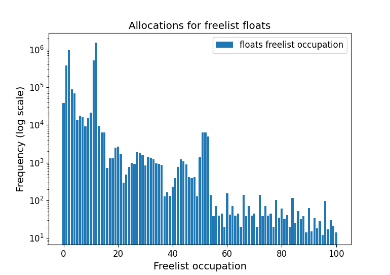
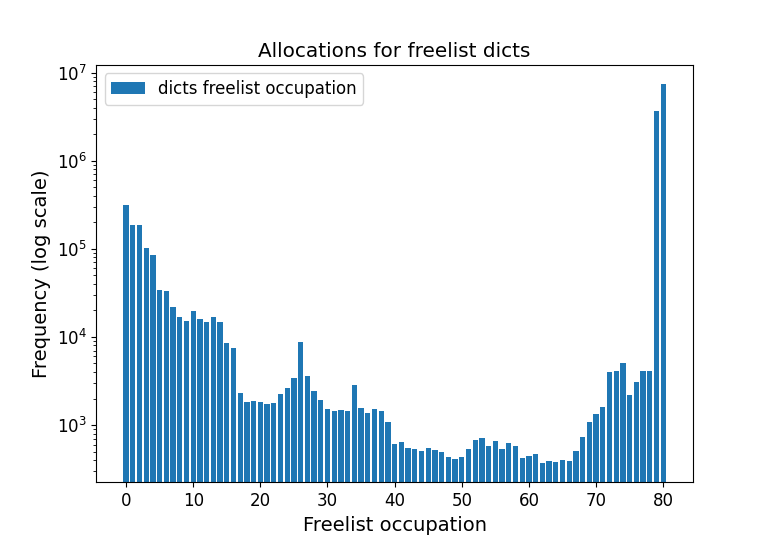
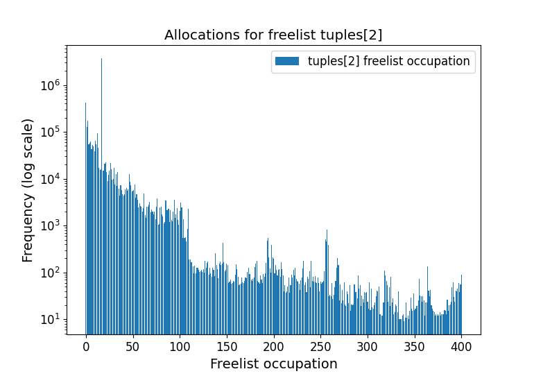
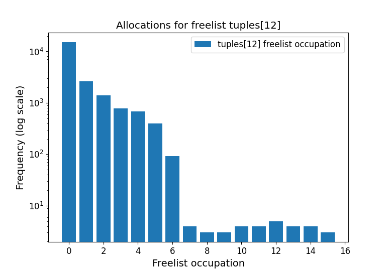
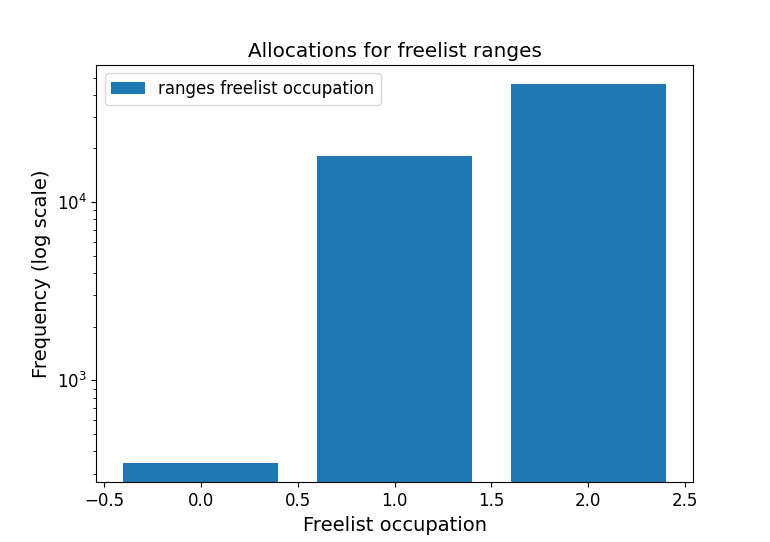

# CPython freelists

The [cpython]([GitHub - python/cpython: The Python programming language](https://github.com/python/cpython/)) implementation contains freelists to improve allocation performance of often used objects such as dicts, lists and tuples.

Here we present results on the allocation statistics for freelists. For each freelist we record how many objects allocations are performed for the freelist size. If allocations are performed while the freelist size is zero, this means there are no objects available on the freelist and a normal allocation is used instead.

Statistics have been gathered with branch [GitHub - eendebakpt/cpython at small_list_freelist_statistics](https://github.com/eendebakpt/cpython/tree/small_list_freelist_statistics).
Full results are available at [freelist_stats.md](freelist_stats.md)

## floats

The first freelist we consider are the python `float` objects. In the histogram below we can see the freelist occupation varies over quite a range. 

## dicts

For the `dict` object there is something strange: the occupation is highest for size 79 and 80. The maximum freelist size for dicts during the gathering of statistics was 80 (see [pycore_freelist_state.h](https://github.com/eendebakpt/cpython/blob/48eb543da314229e719543b5542742490165ef4c/Include/internal/pycore_freelist_state.h#L18)). This suggests much more objects are returned to the freelist than consumed from the freelist. This is possible because objects deallocation only happens in `dict_dealloc` where `_Py_FREELIST_FREE` is called. But construction of new `dict` objects happens in multiple places (`new_dict`, `copy_lock_held`, maybe more) but only in `new_dict` a call to `_Py_FREELIST_POP` is made.
By adding a call to `_Py_FREELIST_POP` in `copy_lock_held` we might be able to get more of the dict freelist.

## tuples

For tuples there are multiple freelists based on the tuple size. The tuples with small size (e.g. 1, 2, 3) are most often used.

For larger sizes the statistics suggest we could do with a much smaller maximum freelist size to achieve similar performance (the same holds for other freelists such as `ranges` and `rangeiters`.

