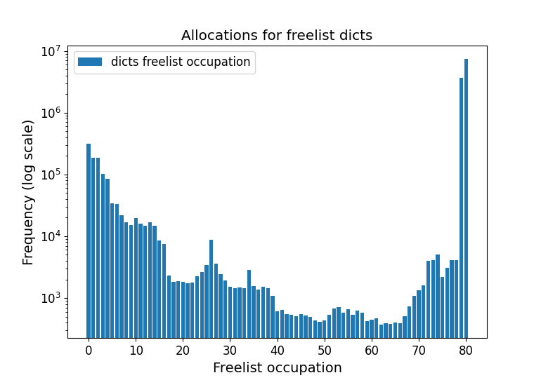
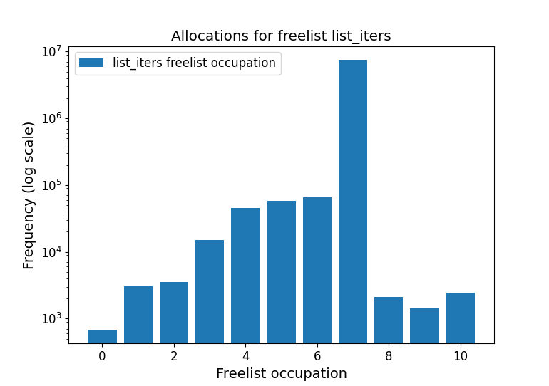
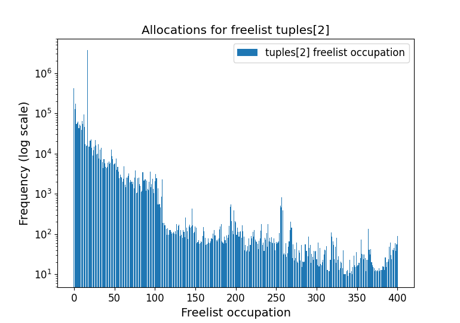
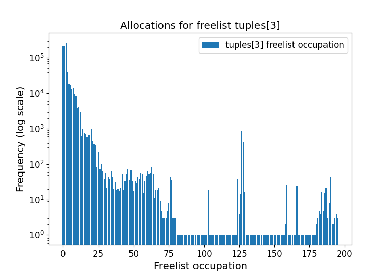
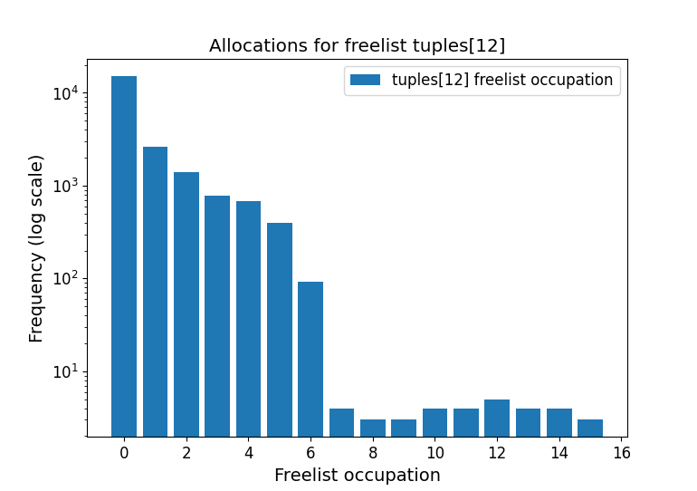
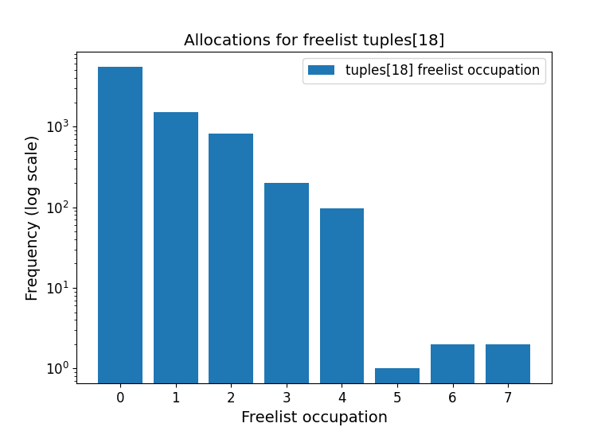

# Freelist allocation statistics

Statistics obtained from the pyperformance benchmark using branch [small_list_freelist_statistics](https://github.com/eendebakpt/cpython/tree/small_list_freelist_statistics).

